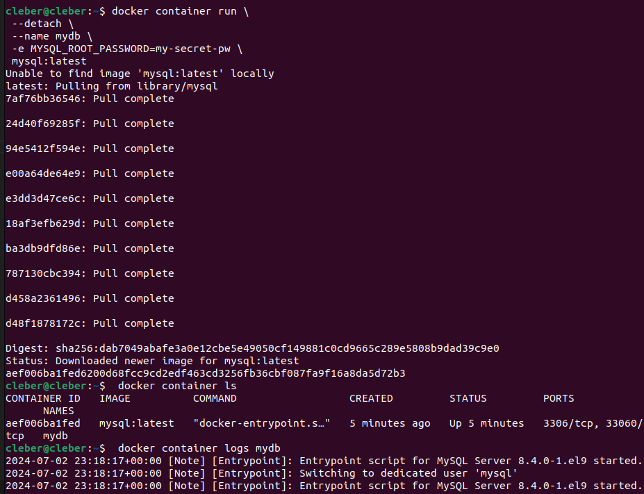
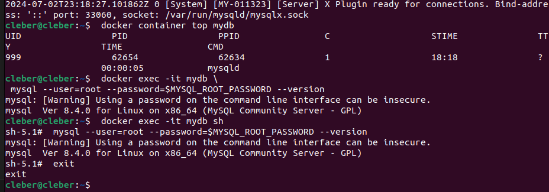

# STAGE 1 - Docker para principiantes - Linux
enlace de recurso [Docker for Beginners - Linux](https://training.play-with-docker.com/beginner-linux/)
## Tarea 0: Requisitos previos
- clonar repositorio `git clone https://github.com/dockersamples/linux_tweet_app`
- crearse un docker id en [Docker Hub](https://hub.docker.com/) 
<br></br>
se genera una copia del repositorio del laboratorio en un nuevo subdirectorio llamado `linux_tweet_app`.
## Tarea 1: 
### Ejecute una sola tarea en un contenedor de Linux alpino
#### Verificar alpine descargado
 - comando `docker container run alpine hostname`
 - OBS: tengo problemas con DockerHub por lo que se continuará localmente<br>
<br>
<br>
 - RESULTADO: verifica que alpine esté localmente (si no lo está la descarga) y luego imprime el nombre del host del contenedor
 - del comando utilizado
    - docker: comando para interactuar con docker
    - container: indica que el comando es relacionado con contenedores
    - run: crea e iniciar un contenedor basado en una imagen especificada
    - alpine: esta es la imagen que se va a usar para crear el contenedo
    - hostname: este es el comando que se va a ejecutar dentro del contenedor
#### listar contenedores creados
 - comando `docker container ls --all`<br>

 - RESULTADO: se muestra la tabla de información de todos los contenedores

 - RESULTADO: se observa que el código  `838ac4f20580` es el mismo que se creó
### Ejecute un contenedor interactivo de Ubuntu
 - comandos usados
 ```bash
docker container run --interactive --tty --rm ubuntu bash
ls /
ps aux
cat /etc/issue 
exit
cat /etc/issue
 ```

 - usos
    - `--interactive` o `-i`: mantiene la entrada estadar abierta
    - `--try` o `-t`: asigna una terminal pseudo-TTY al contenedor, para legibilidad
    - `--rm`: elimina el contenedor, en este caso cuando se detiene
    - ubuntu: imagen que se utiliza para crear el contenedor
    - bash: comando que se ejecutará dentro del contenedor
    - ls /: listará el contenido del directorio raíz
    - ps aux: mostrará los procesos en ejecución en el contenedor
    - cat /etc/issue: mostrará la distro linux
    - exit: saldrá de la sesión
 - RESULTADO: se observa que se ejecuta una distro Ubuntu 24.04 LTS dentro de un contenedor; sin enbargo, en líneas siguientees se verifica que la distro es Ubuntu 22.04.4 LTS por lo que no existe conflicto pese a que son versiones diferentes. Esto facilita que se pueda crear un entorno particular según nuestras necesidades
### Ejecute un contenedor de fondo MySQL
 - comandos usados
 ```bash
 docker container run \
  --detach \
  --name mydb \
  -e MYSQL_ROOT_PASSWORD=my-secret-pw \
  mysql:latest
 ```
  
 - RESULTADO: se busca la imagen localmente y si no se encuentra se descarga colocandole el nombre mydb en la versión más reciente (imagen de ejecución más abajo)
 ```bash
 docker container ls
 docker container logs mydb
 docker container top mydb
 docker exec -it mydb mysql --user=root --password=$MYSQL_ROOT_PASSWORD --version
 docker exec -it mydb sh
 mysql --user=root --password=$MYSQL_ROOT_PASSWORD --version
 exit
 ```

 
- usos
    - --detach o -d: ejecuta el contenedor en segundo plano incluso si cierras terminal
    - --name mydb: asigna nombre
    - -e MYSQL_ROOT_PASSWORD=my-secret-pw : establece variable de entorno
    - mysql:latest: indica imagen que usará para crear contenedor y latest indica versión más reciente
    - ls : listará el contenido del directorio raíz
    - logs: muestra los registros (logs) de un contenedor específico
    - top: muestra los procesos activos
    - mydb: nombre del contenedor
    - exec: ejecuta un comando dentro de un contenedor en ejecución
    - it: Combina -i (modo interactivo) y -t (asigna una terminal TTY).
    - mysql --user=root --password=$MYSQL_ROOT_PASSWORD --version: comando mysql
    - sh: el comando que queremos ejecutar dentro del contenedor (shell sh)
    - exit: saldrá de la sesión
 - RESULTADO: se observa que es posible interactuar mediante líneas de comando dentro de un contenedor para ir modificandolo seǵun nuestro requerimientos. en este caso en particular,configurar una base de datos desde su instalación hasta el ingreso de comandos para verificar la versión que se tiene instalada lista para ser manipulada
## Tarea 2: Empaquetar y ejecutar una aplicación personalizada usando Docker
### Construir una simple imagen de la web
 - comandos usados
   - cd: sirve para moverse de posición en el directorio
   - cat: se usa para mostrar el contenido en el terminal
   - Dockerfile: es el nombre del documento que queremos mostrar
 ```bash
cd ~/linux_tweet_app
cat Dockerfile
 ```
  
 - RESULTADO: se observa el documento Dockerfile con las instrucciones para construir una imagen docker
   - FROM: se especifica la imagen base que necesita `FROM <imagen_base>:<etiqueta>` 
   - COPY: copia archivos desde host al contenedor `COPY <origen> <destino>` (si no se sabe `COPY . /app` copia todo)
   - EXPOSE: indica que el contenedor escucha en los puertos de red especificados en ejecución `EXPOSE <puerto>`
   - CMD: proporciona el comando predeterminado que se ejecutará cuando se inicie un contenedor `CMD ["comando", "argumento1", "argumento2"]`
 - comandos usados
   - export: se utiliza para definir una variable de entorno
   - DOCKERID: nombre de variable de entorno
   - <your docker id>: usuario dockerhub
   - $: se usar para referenciar a una variable
   - echo: imprimir texto o variables en la salida estándar
   - image: se trabaja sobre imagenes docker. Docker puede manejar varios tipos de objetos, como contenedores, imágenes, redes y volúmenes
   - build: construir una nueva imagen Docker a partir de un Dockerfile 
 ```sh
   export DOCKERID=<your docker id>
   echo $DOCKERID
   docker image build --tag $DOCKERID/linux_tweet_app:1.0 .
 ```
  
 - RESULTADO: se está construye una nueva imagen con el docker file se que tiene configurado. en caso de querer otras configuraciones se deberán especificar
 - comandos usados
   - --detach o -d: ejecuta el contenedor en segundo plano
   - --publish 80:80 o -p 80:80: mapea un puerto del contenedor al puerto del host.
   - --name linux_tweet_app: asigna un nombre al contenedor
   - $DOCKERID/linux_tweet_app:1.0: especifica la imagen que se usará
 ```sh
   docker container run \
   --detach \
   --publish 80:80 \
   --name linux_tweet_app \
   $DOCKERID/linux_tweet_app:1.0
 ```
  
 - RESULTADO: se genera una imagen que podrá ser ejecuta
## Tarea 3: Modificar un sitio web en ejecución
### Comience nuestra aplicación web con una montura de atar


 - comandos usados
   - cd: sirve 
 ```sh

 ```
  
 - RESULTADO: 
<br><br><br>
+++++++++++++++
docker container run alpine hostname
docker container run --name my-alpine-container alpine hostname


empaquetar y ejecutar
docker build -t my-tower-app .
docker run --name tower-container my-tower-app

