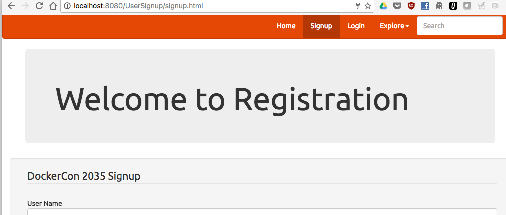

# stage 2
## Getting Started
- ya se tiene varios proyeecto iniciados, por lo que se tendrá en consideración aquello y se mostrará un ingreso diferente

- se ingresará a `Get from VCS` y nos conectaremos a github como indica la guía

- EXPLICACION: se conceden las autorizaciones necesarias para que se pueda cumplir con los requerimiento de la guía
## clone repositorio

- se clona el repositorio que se tiene disponible los proyecto para tener un completo acceso necesario en intelliJ idea

- el repositorio a sido clonado y está listo para ser usado, además se podrá actualizar el repositorio de manera más sencilla

- EXPLICACION: se configuró correctamente todas las dependencias de docker y junto a tomcat es posible ejecutarlo en web

## Manager
- Cuando se creó la imagen de Tomcat, también se configuraron los roles de usuario. el botón Manager App para ver las aplicaciones desplegadas.

- se puede utilizar la página del Gestor para Iniciar, Detener, Recargar o Desinstalar aplicaciones web.se usa docker para poder contenerlo es un entorno controlado creado por nosotros y tomcat lo configura para poder usarlo en web

## Debugging the Application
- En la aplicación, se puede Registrar para crear un nuevo usuario. si se rellene el formulario de registro se puede ingresar

## Configure Remote Debugging
- Tomcat es compatible con la depuración remota de la plataforma Java Debugger Architecture (JPDA). La depuración remota se habilitó cuando se creó la imagen de Tomcat (registration-webserver).

