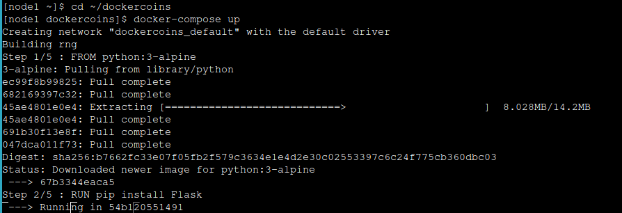

# PLAY WITH KUBERNETES
se busca con este taller comprender los conceptos básicos de Kubernetes para lo cual se necesitarán dos nodos. Se pretende todo realizarlo con los terminales brindados en [kubernetes classroom](https://training.play-with-kubernetes.com/kubernetes-workshop/), pero, ante varias fallas presentadas, si es necesario, se continuará de manera local
# Getting Started
## Start the cluster
### nodo 1
- se inicializa el clúster con el comando `kubeadm init --apiserver-advertise-address $(hostname -i)`
- EXPLICACIÖN: el comando indicado se utiliza para inicializar un clúster de Kubernetes con una configuración específica para la dirección de la API server. el proceso demora unos 2min

- EXPLICACIÓN: en específico  la línea que resulta `kubeadm join 192.168.0.22:6443 --token 2gtm40.0qy4sjwe1ao1uaux --discovery-token-ca-cert-hash sha256:ee36a4eb774f96ed972c9809d54c77bec32f201571e7c55f41ca9bee4354c2ee` es para unir con el segundo nodo
### nodo 2
- con el comando obtenido en el nodo1 se procederá a unir con el nodo2

- EXPLICACIÖN: indica que los nodos se han unido correctamente
### nodo 1
- ahora en el nodo1 ponemos el siguiente comando para iniciar el clúster `kubectl apply -n kube-system -f "https://cloud.weave.works/k8s/net?k8s-version=$(kubectl version | base64 |tr -d '\n')"`

- EXPLICACIÓN: al colocar el comando indica que hay un error al ejecutar el comando, por lo que se intentará areglarlo
- se encuentra errores parecidos en [Stackoverflow.com](https://stackoverflow.com/questions/76673312/kubernates-install-unable-to-connect-to-the-server-dial-tcp-lookup-cloud-weave) indicando que la dirección que se indica está rota, por lo que se realiza las sugerencias.
- el nuevo comando a utilizar será `kubectl apply -f https://github.com/weaveworks/weave/releases/download/v2.8.1/weave-daemonset-k8s-1.11.yaml` que incluye un link actualizado (no el más reciente, pero sí uno que funciona para las necesidades)

- EXPLICACIÓN: no indica que el clúster a sido creado y listo para ser usado

### node 1
- se indica que se ha creado una aplicación en un repositorio dockercoins que se necesita clonar para realizar el proyecto `git clone https://github.com/dockersamples/dockercoins`

- EXPLICACIÖN: nos indica que el repositorio a sido clonado con éxito
### node 1
- nos movemos al repositorio con `cd ~/dockercoins` y utilizamos Compose para construir y ejecutar todos los contenedores `docker-compose up`

- EXPLICACIÖN: nos indica un error de DNS Incorrecto o No Configurado por lo que se tratará de configurar

- EXPLICACIÖN: se detubo el aplicativo y se intentó hacer las configuraciones, pero no permite ningún cambio

- se intenta verificar el SO utilizado en el nodo

- EXPLICACIÖN: se verfica centOS, pero no otorga ningún permiso por lo que no se podrá realizar ninguna modificación. Sin la aplicación no se puede realizar la actividad, por lo que se tratará de realizar localmente en eventos posteriores.
