# Actividad V3: Docker, Kubernetes, Microservicios
# 1. Preparación del entorno:
## Instalar Docker, Docker Compose y Minikube (o un clúster Kubernetes equivalente).
### Instalar Docker and Docker-Compose
- Primero: desinstalar todas las versiones desactualizadas o no oficiales desde la terminarl `for pkg in docker.io docker-doc docker-compose docker-compose-v2 podman-docker containerd runc; do sudo apt-get remove $pkg; done`

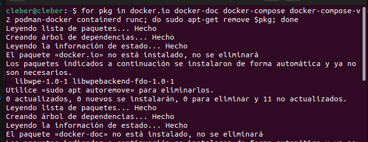
- EXPLICACIÓN: en la imagen se muestra que se pretende desintalar docker, pero no se encuentra instalado. En este caso se está usando una máquina virtual sin configuraciones.

- Segundo: se realizan las configuraciones con descargas necesarias
```sh
# Add Docker's official GPG key:
sudo apt-get update
sudo apt-get install ca-certificates curl
sudo install -m 0755 -d /etc/apt/keyrings
sudo curl -fsSL https://download.docker.com/linux/ubuntu/gpg -o /etc/apt/keyrings/docker.asc
sudo chmod a+r /etc/apt/keyrings/docker.asc

# Add the repository to Apt sources:
echo \
  "deb [arch=$(dpkg --print-architecture) signed-by=/etc/apt/keyrings/docker.asc] https://download.docker.com/linux/ubuntu \
  $(. /etc/os-release && echo "$VERSION_CODENAME") stable" | \
  sudo tee /etc/apt/sources.list.d/docker.list > /dev/null
sudo apt-get update
```
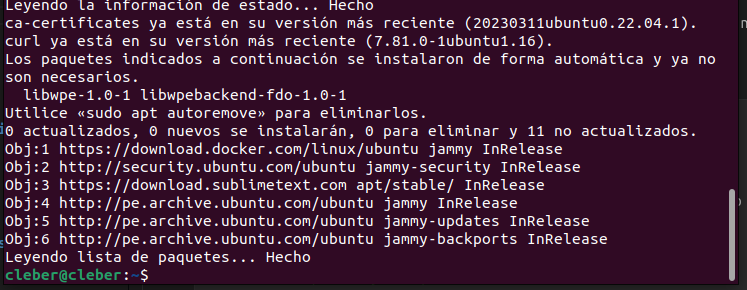
- EXPLICACIÓN: se ha instalado las dependencias y realizado las configuraciones necesarias para que se instale sin problemas docker

- Tecero: se instala la última versión de docker `sudo apt-get install docker-ce docker-ce-cli containerd.io docker-buildx-plugin docker-compose-plugin`

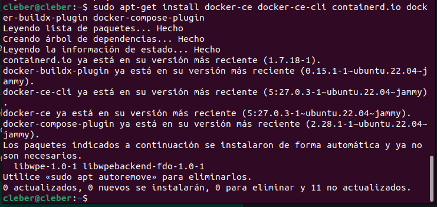
- EXPLICACIÓN: se ha instalado la versión más reciente de docker-ce 5:24.0.3-1 para Ubuntu 22.04 que es la que se tiene instalada

- Cuarto: instalar docker-compose con `udo apt-get install ./docker-desktop-<arch>.deb` verificar versiones de instalación de docker y docker versión además de sus funcionamiento en cliente y servidor

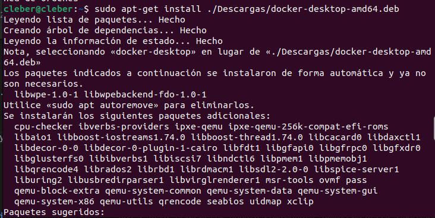
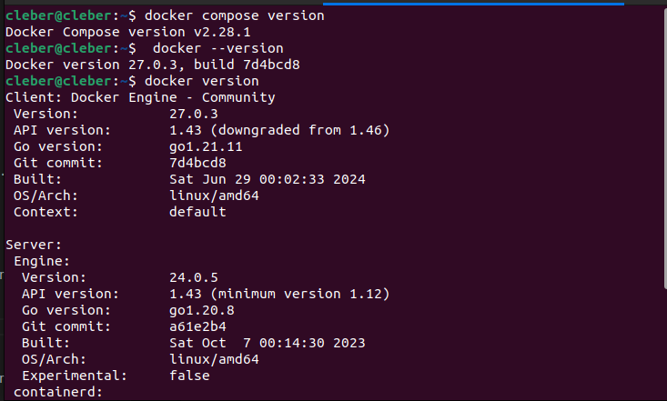
- EXPLICACIÓN: Se ha instalado las dependecias para Docker-compose y el docker-desktop. todos los servicios necesarios están instalados
### Instalar Minikube
- Primero: Se descarga la versión de minikube para el SO en funcionamiento `curl -LO https://storage.googleapis.com/minikube/releases/latest/minikube_latest_amd64.deb`
- Segundo: Se instala el paquete .deb descargado `sudo dpkg -i minikube_latest_amd64.deb`

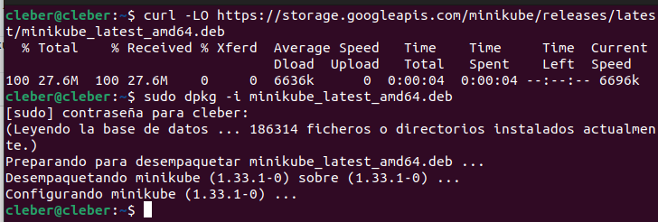
- EXPLICACIÓN: se realiza  la descarga de la versión seleccionada y se instala corretamente minikube versión 1.33.1-0
# 2. Desarrollar los microservicios:
## Crear los archivos Java para cada microservicio (GameService, MapService, PlayerService, TowerService, WaveService).
### GameService
```java
public class GameService {
    private MapService mapService;
    private PlayerService playerService;
    private List<WaveService> waves;
    public GameService() {
        this.mapService = new MapService();
        this.playerService = new PlayerService();
        this.waves = new ArrayList<>();
    }
    public void placeTower(TowerService tower, int x, int y) {
        mapService.placeTower(tower, x, y);
    }
    public void startWave() {
        WaveService wave = new WaveService();
        waves.add(wave);
        wave.start();
    }
    public void gameState() {
        System.out.println(mapService);
        System.out.println("Puntuación: " + playerService.getScore());
        System.out.println("Vida de la base: " + playerService.getBaseHealth());
    }
}
```
- EXPLICACIÓN: clase GameService con atributos y constructor necesario para el funcionamiento de juego
    - placerTower: método para colocar un tipo de torre seleccionado en la posición xy indicada utilizando un método del mapa del juego
    - startWave: para realizar una nueva oleada con los enemigos que le correspondan
    - gameState: vara imprimir la situación de ese momento del juego
### MapService
```java
public class MapService {
    private char[][] grid;
    public MapService() {
        grid = new char[5][5];
        for (int i = 0; i < 5; i++) {
            for (int j = 0; j < 5; j++) {
                grid[i][j] = ' ';
            }
        }
    }
    public void placeTower(TowerService tower, int x, int y) {
        grid[x][y] = tower.getSymbol();
    }
    @Override
    public String toString() {
        StringBuilder sb = new StringBuilder();
        for (char[] row : grid) {
            for (char cell : row) {
                sb.append("[").append(cell).append("]");
            }
            sb.append("\n");
        }
        return sb.toString();
    }
}
```
- EXPLICACIÓN: clase MapService con atributo que hace referencia al tablero o campo de juego y constructor necesario para el registro del juego
    - placerTower: método para colocar un tipo de torre seleccionado en la posición xy indicada
    - toString: sobreescritura para que se puede realizar la impresión deseada de la clase
### PlayerService
```java
public class PlayerService {
    private int score;
    private int baseHealth;
    public PlayerService() {
        this.score = 0;
        this.baseHealth = 100;
    }
    public int getScore() {
        return score;
    }
    public int getBaseHealth() {
        return baseHealth;
    }
}
```
- EXPLICACIÓN: clase PlayerService con atributos del jugador y constructor necesario para el registro de la situación del jugador. Se le añaden getter de los atributos
### TowerService
```java
public class TowerService {
    private char symbol;
    public TowerService(char symbol) {
        this.symbol = symbol;
    }
    public char getSymbol() {
        return symbol;
    }
}
```
- EXPLICACIÓN: lase TowerService con atributos para señalar el tipo de torres y constructor necesario. Se le añaden getter del atributo
### WaveService
```java
public class WaveService {
    public void start() {
        System.out.println("Oleada iniciada!");
    }
}
```
- EXPLICACIÓN: clase WaveService para indicar la oleada que se acerca de enemigos
    - start: método void solo para una impresión de la oleada que debería darse.
# 3. Configurar Docker:
## Crear un Dockerfile para cada microservicio.
- se crea un DockerFile_Servicio para cada uno con la siguiente estrucutra que se explica con comentarios dentro
```Dockerfile
# imagen base para el contenedor
FROM openjdk:17
# directorio de trabajo del contenedor
WORKDIR /app
# archivos que se copiarán en el contenedor. en este caso todos
COPY . .
# compila todos los archivos Java en el directorio 
RUN javac src/main/java/org/example/*.java
# comando por defecto para que se inicie el servicio
CMD ["java", "-cp", "src/main/java", "org.example.Service"]
```
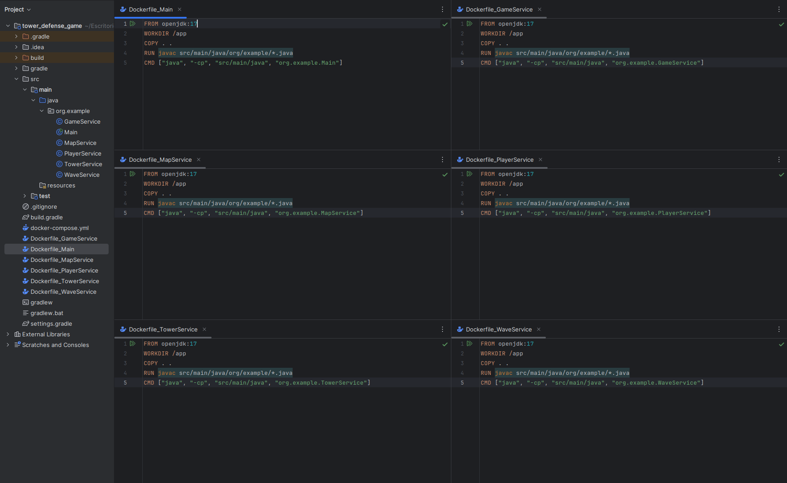
- EXPLICACIÓN: se muestra el Dockerfile de cada microservicio cambiando el nombre correspondiente a cada uno para que sea fácilmente identificable
## Construir las imágenes Docker usando el comando docker build.
- se utiliza el comando ` docker build -t game-service .` para crear las imagenes
`

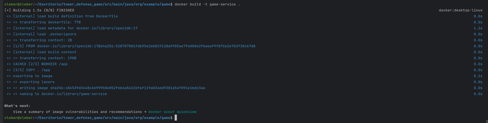
- EXPLICACIÓN: se ha creado la imagen de GameService  correctamente y al final de brinda la recomendación de uso de una herramienta.
- se crea las imagenes para los demás servicios

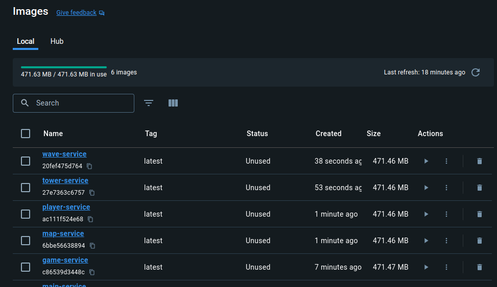
- EXPLICACIÓN: se ha creado correctamente todos las imagenes solicitadas y se encuentra aún no iniciadas. se muestra también su id debajo de cada nombre
# 4. Configurar Docker Compose:
## Crear un archivo docker-compose.yml para definir cómo los contenedores interactuarán entre sí.
- se debide el docker-compose.yml
```yml
version: '3'
services:
    game:
        build: ./game
        networks:
            - game-network
        volumes:
            - game-data:/app/data
    map:
        build: ./map
        networks:
            - game-network
    player:
        build: ./player
        networks:
            - game-network
    tower:
        build: ./tower
        networks:
            - game-network
    wave:
        build: ./wave
        networks:
            - game-network
networks:
    game-network:
        driver: bridge
volumes:
    game-data:
        driver: local
```
- EXPLICACIÓN: se indica cada servicio que se usará con su respectivo dockerfile que se usará y a qué red se conectará, además de la red de todo el programa (driver bridge) y el volumen que se usará (local)
## Levantar los servicios definidos en Docker Compose usando docker-compose up.
- se ejecuta el comando `docker-compose up --build`

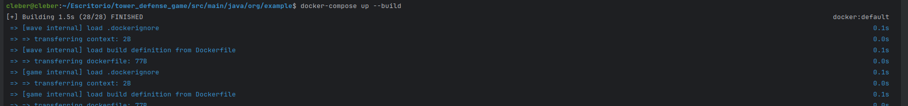
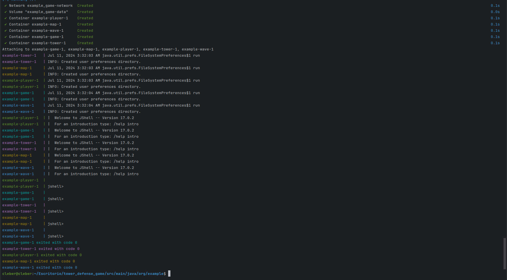
- EXPLICACIÓN: se crean los contenedores correctamente y se levantan cada uno de los servicios que se conectarán a  la red game-network además de montar el volumen game-data en el servicio game. al final de distintos colores se mostraron los contenedores que estaban en ejecución, pero no se ejecutaron en segundo plano para que se pueda interactuar.
# 5. Desplegar en Kubernetes:
## Crear archivos de despliegue (deployment.yaml) y servicio (service.yaml) para cada microservicio.
- se crea el archivo `game-deployment.yaml`
```yaml
apiVersion: apps/v1
kind: Deployment
metadata:
  name: game-deployment
spec:
  replicas: 1
  selector:
    matchLabels:
      app: game-service
  template:
    metadata:
      labels:
        app: game-service
    spec:
      containers:
      - name: game-service
        image: game-service
        ports:
        - containerPort: 8080

```
- EXPLICACIÓN: se indica las configuraciones para el despliegue de kubernetes para la aplicación game-service especificando sobre todo el puerto en el que se ejecutará
- se crea el archivo `game-service.yaml`
```yaml
apiVersion: v1
kind: Service
metadata:
  name: game-service
spec:
  selector:
    app: game-service
  ports:
    - protocol: TCP
      port: 80
      targetPort: 8080
  type: LoadBalancer
```
- EXPLICACIÓN: se definen los recursos del servicio en kubernetes para la aplicación game-service indicando el puerto y el protocolo que se usará para la comunicación
## Aplicar las configuraciones de Kubernetes usando kubectl apply.
- iniciamos minikube `minikube start` y verificamos su estado disponible para usarlo `minikube status`, luego ejecutamos los comandos de creación `kubectl apply -f game-deployment.yaml` y `kubectl apply -f game-service.yaml`

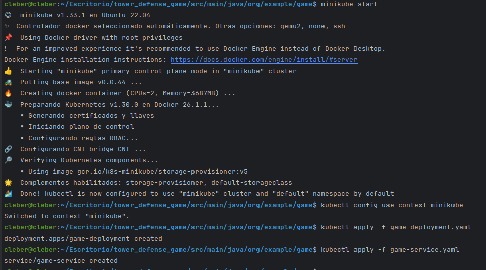
- EXPLICACIÓN: la imagen indica que minikube ya se encuentra iniciado y configurado, además que los servicios han sido desplegados correctamente con las configuraciones necesarias. también se deplegaran  los demás

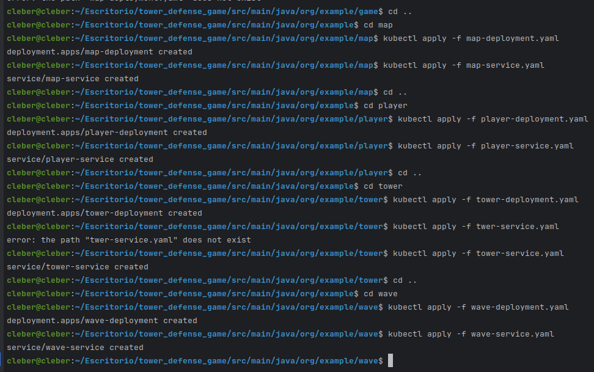
- EXPLICACIÓN: todos las configuraciones de despligue se han creado correctamente
# 6. Verificar despliegue:
## Usar comandos kubectl para verificar que los pods y servicios estén funcionando correctamente (kubectl get pods, kubectl get services).
- se busca verificaciones
- comando `kubectl get pods`

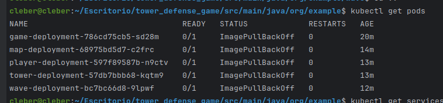
- EXPLICACIÓN: se muestra los estados de los cinco pods creados y muestran que ninguno está fallando y que no están iniciados
- comando `kubectl get services`

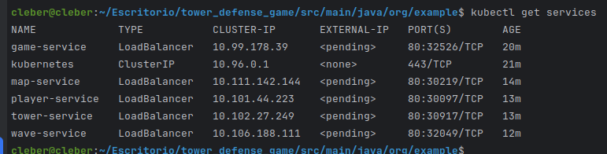
- EXPLICACIÓN:  muestra la información sobre los cinco servicios, incluyendo sus nombres, tipos, direcciones IP y puertos 
# 7. Implementar pruebas:
## Escribir pruebas unitarias e integración usando Mockito.
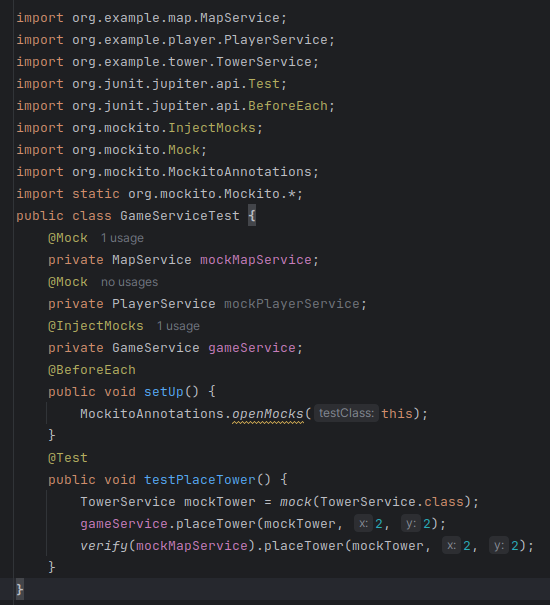
- EXPLICACIÓN:  crean objetos mock (mockMapService, mockPlayerService, y mockTower) para reemplazar las dependencias reales. Esto permite aislar la clase GameService y probar su comportamiento sin depender de las implementaciones reales de MapService y PlayerService. El propósito de esta prueba unitaria es asegurarse de que el método placeTower de GameService funciona correctamente y llama al método correspondiente en MapService.
## Configurar y ejecutar pruebas de mutación para asegurar la robustez del código.
- configuración del gradle 
```groovy
plugins {
    id 'java'
    id 'info.solidsoft.pitest' version '1.15.0'
}

group = 'org.example'
version = '1.0-SNAPSHOT'

repositories {
    mavenCentral()
}

dependencies {
    testImplementation 'org.junit.jupiter:junit-jupiter-api:5.8.2'
    testImplementation 'org.junit.jupiter:junit-jupiter-params:5.8.2'
    testRuntimeOnly 'org.junit.jupiter:junit-jupiter-engine:5.8.2'
    pitest 'org.pitest:pitest-junit5-plugin:1.1.0'
    testImplementation 'org.assertj:assertj-core:3.23.1'
    testImplementation 'org.mockito:mockito-inline:3.12.4'
    testImplementation 'org.mockito:mockito-junit-jupiter:3.12.4'
}

test {
    useJUnitPlatform()
}

pitest{
    targetClasses = ['org.example.*']
    outputFormats = ['HTML']
    timestampedReports = false
}
```
- EXPLICACIÓN: se añaden las dependencias de mockito y pitest para que se puedan realizar las pruebas unitarias y de mutación
- ejecutar el comando `./gradlew pitest`

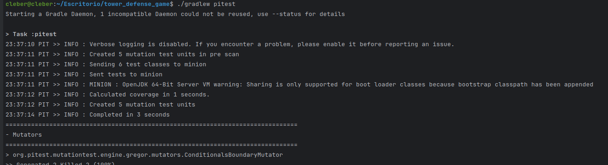
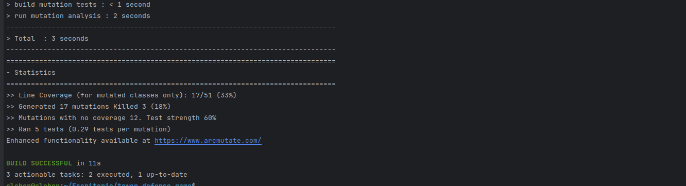
- EXPLICACIÓN: se ejecuta correctamente las configuraciones realizadas en el grandle para el uso de pitest